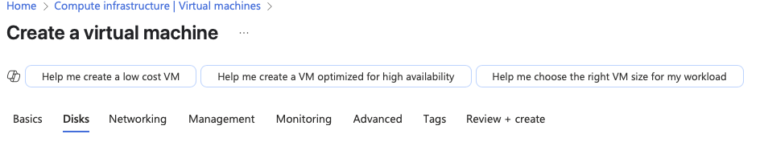

# Creating Windows and Linux Virtual Machines on Microsoft Azure

This tutorial walks you through creating a Windows 11 and an Ubuntu Linux virtual machine using the Microsoft Azure Portal. Screenshots included to guide your steps.

---

## Step 1: Open the Azure Portal

Go to: https://portal.azure.com  

---

## Step 2: Create a Resource Group

1. Click **Resource groups** in the left menu  
2. Click **+ Create**  
3. Name it `RG-Network-Activities` (or a name of your choice)  
4. Set Region to `(US) East US 2`  
5. Click **Review + create**, then **Create**  

---

## Step 3: Create a Windows Virtual Machine

1. Go to **Virtual Machines**  
2. Click **+ Create → Azure virtual machine**  
3. Select the Resource Group  
4. Fill in basic details:  
   - Name: `windows-vm`  
   - Image: `Windows 11 Pro`  
   - Size: `Standard_D2s_v3`  
   - Username: `labuser`  
   - Password: Your secure password  
   - Allow RDP (3389)  

---

## Step 4: Create a Linux Virtual Machine

Repeat the same process but use:  
- Name: `linux-vm`  
- Image: `Ubuntu Server 22.04 or 24.04 LTS`  
- Allow SSH (22)  

---

## Step 5: Configure Disks

- Use **Premium SSD**  
- Enable auto-delete on VM delete  

---

## Step 6: Configure Networking

- Use the same virtual network as `windows-vm`  
- Ensure public IP is assigned  
- Allow necessary ports  

---

## Step 7: Skip Unnecessary Tabs

- Skip **Management**, **Monitoring**, **Advanced**, **Tags** (not essential for labs)

---

## Step 8: Review and Create

Azure validates the config. If passed, click **Create**  

---

## Step 9: Deployment Progress and Completion

- Wait for "Deployment Succeeded"
- Click **Go to resource**  

---

## Step 10: Verify Virtual Machines

Check that both VMs are **running** with assigned Public IPs  

---

## ✅ Best Practices

- Shutdown unused VMs to save cost  
- Use NSGs and restricted IPs  
- Use Bastion or VPN for secure access  
- Apply tags for better resource management  

---

*This guide was created for training and learning purposes on Microsoft Azure.*
